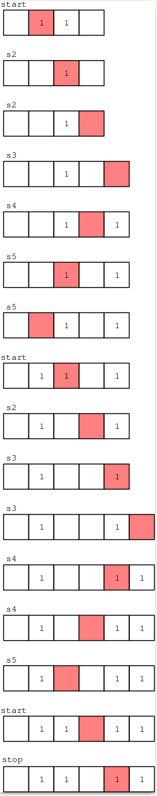

# Turing Machine Lab in Prolog

This is a `Prolog` (using [ECLiPSe Prolog](ghttp://www.eclipseclp.org/)) lab in which we build a `Turing` machine, and in its optional part we explore the busy beaver function.

To get the states and tape of the `Turing` machine during its run you can do (you need `mpost` and `epstopdf` and to add the correct path to `ECLiPSe` in `turing.sh`)

```bash
./turing.sh
```

To change the program and/or the input of the program, go to the `main` predicate of the `turing.ecl` file

```prolog
main :-
    Program = program(
        start, 
        [stop], 
        [
         delta(start, ' ', ' ', right, stop),
         delta(start, 1, ' ', right, s2),
         delta(s2, 1, 1, right, s2),
         delta(s2, ' ', ' ', right, s3),
         delta(s3, 1, 1, right, s3),
         delta(s3, ' ', 1, left, s4),
         delta(s4, 1, 1, left, s4),
         delta(s4, ' ', ' ', left, s5),
         delta(s5, 1, 1, left, s5),
         delta(s5, ' ', 1, right, start)
        ]
    ),
    Input = [1, 1],
    run_turing_machine(Program, Input, _Output, _FinalState, Dump),
    dump_to_mpost("turing_run.mp", Dump)
```

If you want to do the lab you can find the subject (in french) in the `tp.pdf` file, a skeleton in the `skeleton.ecl` file and the solution in `solution.ecl`

